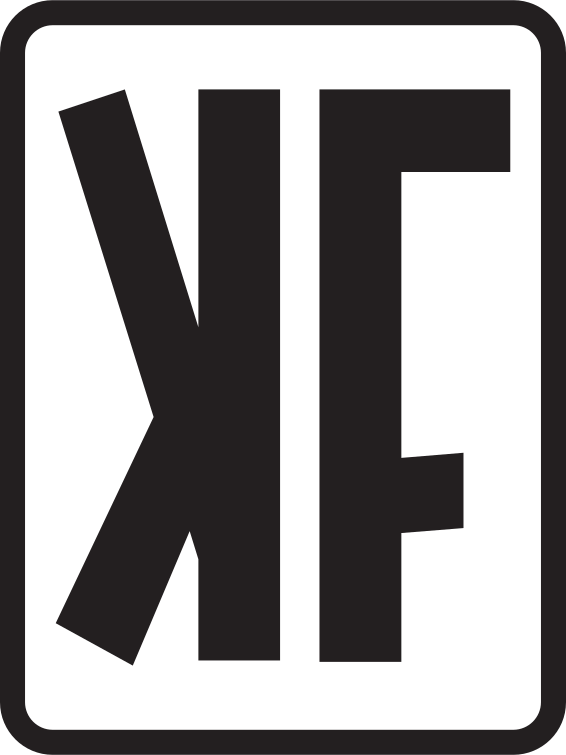

# Kombination Funk Archive

This repository contains a basic React app that displays all of the Kombination Funk flyers we have collected over the years. 

If you would like to contribute some flyer donations, follow these steps:

1. First of all, thanks for keeping the memories alive! We hope you had a good rave up back in the Blueprint!!

2. Take a picture of the flyer front and back, with just a little border around it, if possible. 

3. If you have Github fu, then try creating a PR. 

4. If number 3 above sounds like Greek to you, then send me a message [on Facebook](https://www.facebook.com/chrismacp/) and we can sort it out. 

5. Basque in the fully updated archive.

Thanks for your help!

========================================================

========================================================

## Development 

This project uses [create-react-app](https://create-react-app.dev/) and [react-boostrap](https://react-bootstrap.netlify.app/docs) for the app and [gh-pages](https://www.npmjs.com/package/gh-pages) to deploy to Gihub pages.

### Adding new flyers

1. Just name them as follows: <year>-<month>-(front|back).jpg, for example '2002-03-front.jpg'.
2. Put the flyer files in the public/images/flyers/ directory
3. Run `npm run build`
4. Run `npm run deploy` (This actually deploys the site without committing to main, this isn't critical so no worries)
5. Then commit and push your code.

### Run locally

1. Run `npm start`

